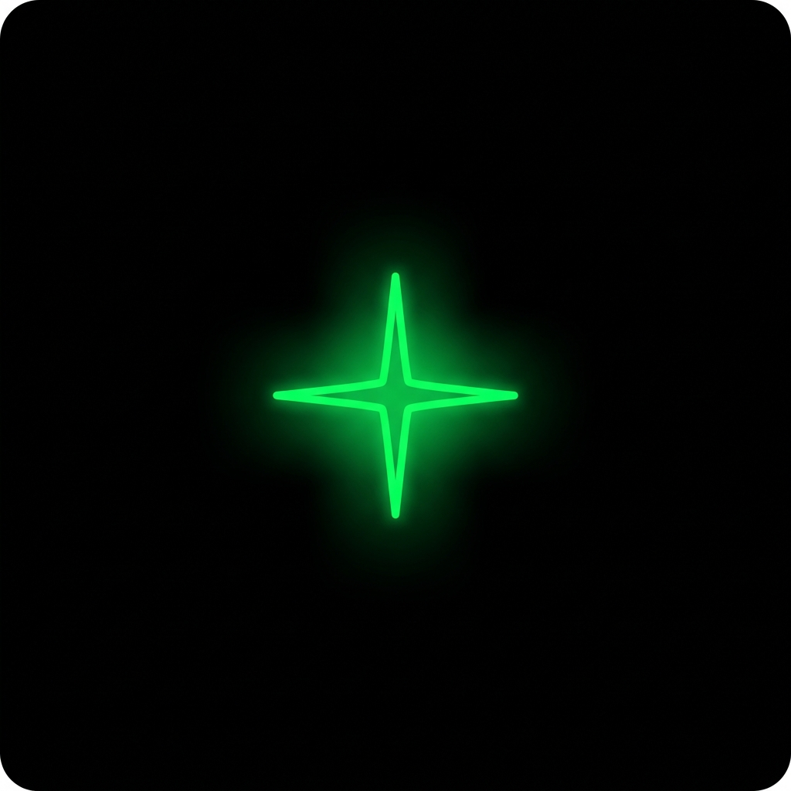

<p align="center">
  
</p>

<h1 align="center">Connect AI v2 (P-Reinforce)</h1>

<p align="center">
  <strong>Claude-Powered · Autonomous Knowledge Engine · AI 1인 기업 워크스페이스</strong><br/>
  VS Code / Cursor 확장 프로그램으로, 당신의 낡은 IDE를 최상위 에이전트 대학(A.U)의 심장으로 진화시킵니다.
</p>

<p align="center">
  
  
  
  
  
</p>

---

## 🌟 Overview: The P-Reinforce Architecture

Connect AI v2.90.0은 단순한 코딩 에이전트를 넘어섭니다. **P-Reinforce 아키텍처**를 기반으로 설계된 이 에이전트는 사용자의 모든 정보와 지시를 받아들여 **스스로 의미를 분석하고, 폴더를 생성하고, 마크다운 위키 파일로 정리하여 클라우드에 자동 백업**하는 자율 지식 정원사(Autonomous Gardener)입니다.

---

## ⚡ Core Features

### 1. 🧠 Agent University (A.U) 완벽 연동
Agent University 웹 플랫폼과 실시간으로 통신합니다.
웹에서 버튼 한 번 누르는 즉시, 로컬 VS Code의 `4825` 포트를 통해 프리미엄 브레인 팩(Premium Brain Pack) 지식이 로컬 인공지능 뇌(`~/.connect-ai-brain`)에 자동 주입되어 신경망을 확장합니다.

### 2. 📂 자율 지식 구조화 (Zero-Interaction Styling)
유저가 던져주는 원시 데이터(Raw Data)를 에이전트가 스스로 판단해 `10_Wiki`, `00_Raw`, `🚀 Skills` 와 같은 완벽한 P-Reinforce 템플릿 규격의 Markdown 파일로 분할-조립하여 저장합니다.

### 3. ☁️ 클라우드 동기화 (Auto-Git Sync 100%)
로컬 PC에서 파일 생성이 일어나는 순간, 에이전트가 스스로 GitHub 저장소에 `git add`, `commit`, `push`를 수행합니다.
마스터는 이제 지루한 푸시 커맨드를 입력할 필요가 없습니다.

### 4. 🔗 Claude 3-Tier 모델 자동 라우팅 (Dynamic Model Tiering)
업무 난이도에 따라 Claude Opus 4.7 / Sonnet 4.6 / Haiku 4.5 가 자동으로 선택됩니다. 어떤 모델을 쓸지 번거롭게 입력하지 마십시오 — CEO 에이전트가 작업 컨텍스트를 보고 알아서 라우팅합니다.

---

## ⚒️ Agent Capabilities (에이전트 권한)

로컬 머신의 파일 시스템과 터미널에 대한 통제권을 인공지능에게 부여합니다. (100% 안전한 권한 승인 기반)

| Action | Description |
|:--|:--|
| **📄 Create Files** | 새로운 파일과 폴더를 생성합니다 |
| **✏️ Edit Files** | 기존 파일 내의 코드를 수정합니다 |
| **🗑️ Delete Files** | 불필요한 파일을 즉각 파쇄합니다 |
| **📖 Read Files** | 마스터의 프로젝트 파일을 읽어 맥락을 파악합니다 |
| **📂 Browse Directories** | 디렉토리 구조를 분석합니다 |
| **🖥️ Run Commands** | `npm run build`, `git push` 등 터미널 명령을 수행합니다 |

---

## 🤝 Companion Repo
이력서·구직 가이드 외에, 한일 SNS 자동 컨텐츠 봇 (Threads/Instagram/X 멀티 계정) 은 별도 repo:
- 👉 https://github.com/copyNdpaste/content-bot-ai


## 📥 Installation (설치 방법)

### A.U 멤버십 유저 (Recommended)
1. 상단 탭의 [Releases](https://github.com/wonseokjung/connect-ai/releases) 메뉴로 진입.
2. 최신 `v2.90.0.vsix` 파일을 다운로드.
3. VS Code 에서 `Cmd+Shift+P` → **Extensions: Install from VSIX** → 다운받은 파일 선택

### 개발자 빌드 (Build from Source)
```bash
git clone https://github.com/wonseokjung/connect-ai.git
cd connect-ai
npm install
npm run compile
npx vsce package
```

---

## 🤖 Claude Powered

Connect AI는 **Claude Code CLI** 위에서 동작합니다. 사장님(sajangnim)이 이미 보유한 **Claude Max 구독**이 모든 LLM 호출을 처리합니다. 별도 API 키 발급·요금 정산 없이, 한 구독으로 전체 에이전트 팀이 굴러갑니다.

### 3-Tier 모델 정책

| Tier | 모델 | 용도 |
|:--|:--|:--|
| **Heavy** | Claude Opus 4.7 | 사업 평가, 코드 생성, 핵심 의사결정 |
| **Standard** | Claude Sonnet 4.6 | 대부분의 에이전트 일상 업무 |
| **Light** | Claude Haiku 4.5 | 요약, 스코어링, 짧은 분류 작업 |

### 사전 요구 사항

`claude` CLI가 PATH에 설치되어 있어야 합니다. 설치 한 줄:

```bash
<install command>
```

> NOTE: 위 `<install command>` 는 최신 공식 설치 명령으로 교체해 주세요. (예: `npm install -g @anthropic-ai/claude-code` 형태가 일반적이지만, 배포 시점에 공식 가이드에서 한 번 더 확인 후 확정).

설치 후 터미널에서 `claude --version` 이 동작하면 Connect AI가 자동으로 인식합니다. 비표준 위치에 설치한 경우 VS Code 설정에서 `connectAiLab.claudeBinPath` 에 직접 경로를 지정할 수 있습니다.

---

---

<p align="center">
  <strong>Built for Antigravity & Agent University</strong><br/>
  Designed by <a href="https://github.com/wonseokjung">Jay</a> × Connect AI Architect
</p>
